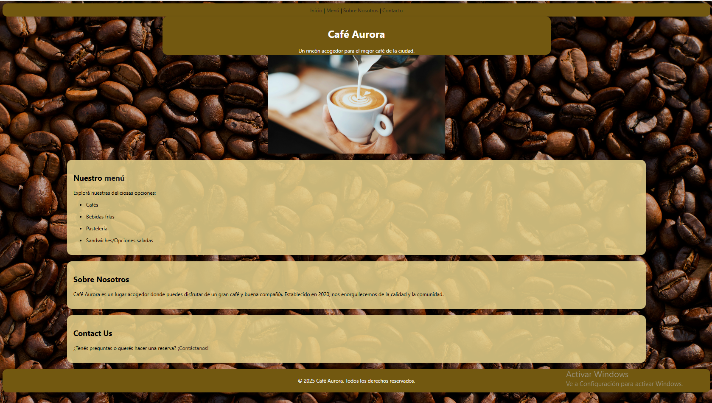

# Aurora Café – Sitio Web

Aurora Café es un sitio web ficticio creado para practicar y mejorar mis habilidades en **HTML5** y **CSS3**.  
El objetivo del proyecto es simular la página oficial de una cafetería artesanal, con secciones reales como Inicio, Menú, Sobre Nosotros y Contacto.  
Este proyecto representa una práctica completa de maquetación, diseño básico y estructura multipágina.

---

## 🌐 Demo en vivo
👉 *El enlace se agregará cuando el sitio sea publicado mediante GitHub Pages.*

---

## 🖼️ Vista previa

---

## 📂 Contenido del Sitio

El proyecto incluye las siguientes páginas:

- **Inicio.html:** Página principal del sitio con presentación general.
- **Menu.html:** Sección con las categorías y precios del menú.
- **About.html:** Página “Sobre Nosotros”.
- **Contact.html:** Página de contacto con formulario.
- **Barista.html / Coffee Shop.html:** Recursos adicionales utilizados para ilustración o contenido.
- **Carpeta de imágenes:** Imágenes usadas en cada sección.
- **Archivos CSS individuales:**  
  - Styles Inicio  
  - Styles About  
  - Styles Menu  
  - Styles Contact  

Cada HTML carga su propio archivo CSS independiente para mantener la edición clara y sencilla.

---

## 🎯 Objetivos del proyecto

- Practicar la estructura de un sitio web multipágina.  
- Desarrollar estilos con **CSS3** sin frameworks.  
- Manejar imágenes, fondos y posiciones.  
- Entender rutas relativas entre archivos HTML y carpetas.  
- Preparar un proyecto real para mi portfolio personal.  
- Publicar el sitio mediante **GitHub Pages**.

---

## 🛠️ Tecnologías utilizadas

- **HTML5**
- **CSS3**
- Recursos gráficos libres (Unsplash, Pexels, Pixabay)
- GitHub para hosting (GitHub Pages)

---

## 🗂️ Estructura del proyecto 

- Café Aurora/
  - Inicio.html
  - Menu.html
  - About.html
  - Contact.html
  - Barista.jpg
  - Café.jpg
  - Coffee shop.jpg
  - Fondo About.jpg
  - Fondo menu.jpg
  - Img inicio.jpg
  - Img menu.jpg
  - Styles Inicio.css
  - Styles About.css
  - Styles Menu.css
  - Styles Contact.css

---

## 🚀 Cómo ver el proyecto en tu PC

1. Descargá la carpeta completa.  
2. Abrí **Inicio.html** en cualquier navegador.  
3. Navegá entre páginas usando los enlaces.

---

## 📸 Créditos de las imágenes

Las imágenes del proyecto provienen de sitios gratuitos y sin derechos de autor:

- **Unsplash**
- **Pexels**

---
  
## 📄 Licencia

Proyecto creado exclusivamente con fines educativos y de práctica personal.

---

## ⭐ Autor

Desarrollado por **Gio Batta Cao Favot** como parte de su portfolio y aprendizaje de desarrollo web.
